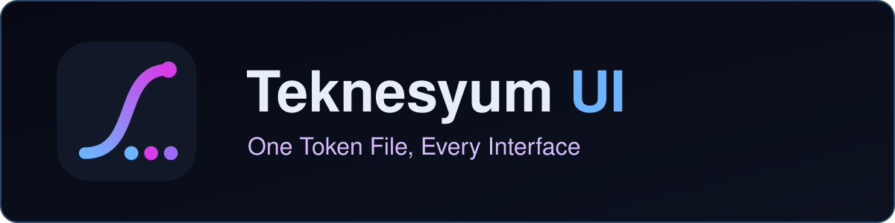
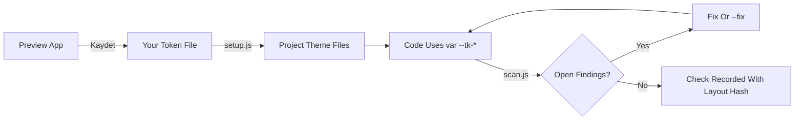
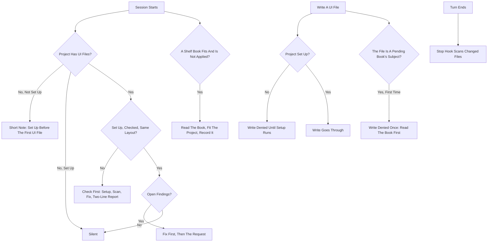
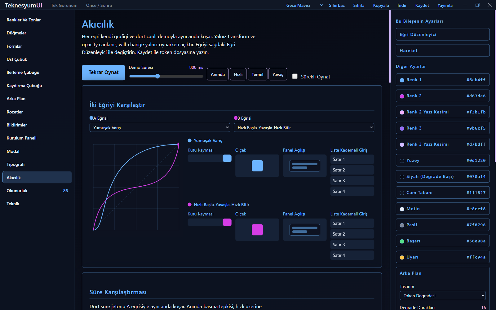
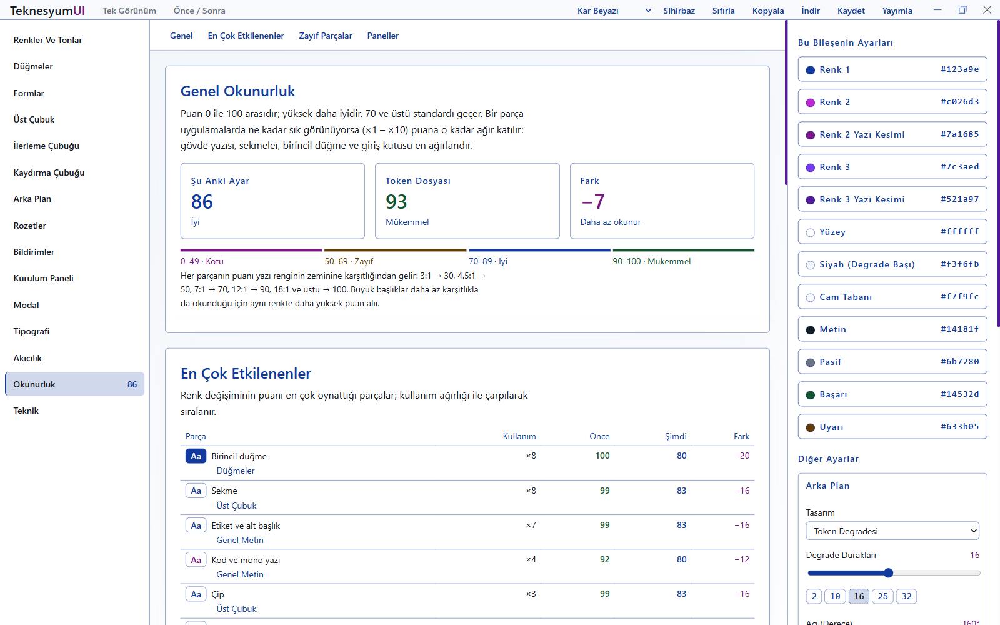
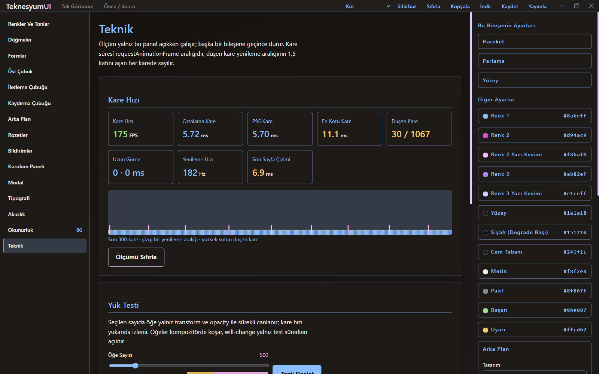
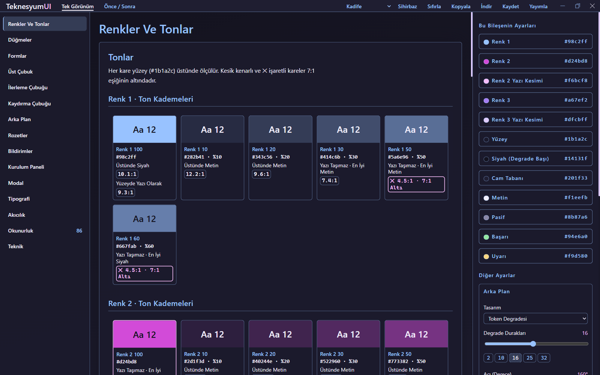
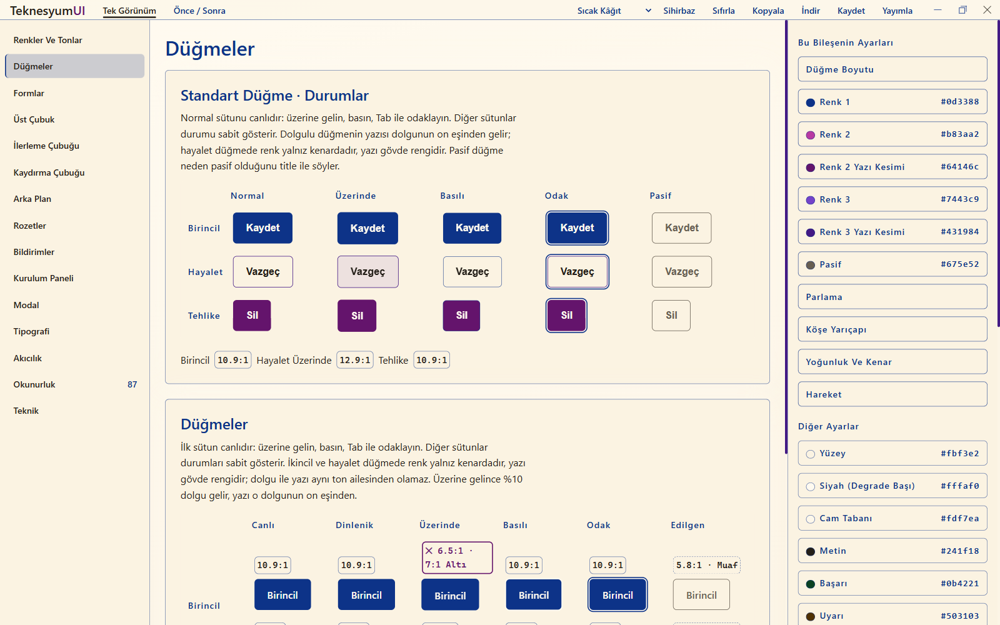
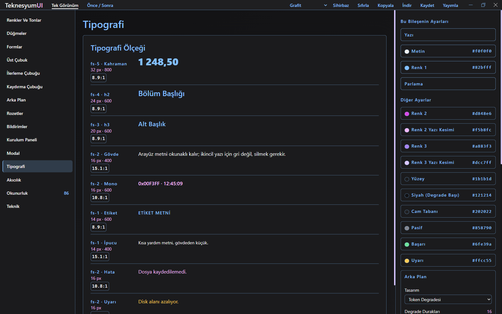

<!-- lang -->

[](README.tr.md)



# Teknesyum UI

Tokens, scanner, hooks.

| | |
|---|---|
| Scanner rules | 102, in 9 modules (`scan.js --list-rules`) |
| Themes | 9 — 5 light, 4 dark; every one passes 7:1 and scores 85 or more (`tema.js denetle`) |
| Tests | 439 assertions, no dependencies (`npm test`) |
| Cost of an ordinary turn | 0 tokens — no hook writes context on a turn |
| Cost of a session start | 0 tokens on a clean project; one note of about 150–250 tokens when there is UI work to do |
| Cost of the skill | `SKILL.md`, 93 lines, about 1,000 tokens, loaded only when UI work starts |

## What It Is

A Claude Code plugin that holds one interface layout — colours, type, radius, motion, glow,
title bar — in a token file, and makes every project build from it. Setup writes the theme
into the project, the scanner checks the code against it, and three hooks make sure the
check runs: once when a session opens, before the first UI file is written, and when a turn
ends. The layout is edited in a desktop preview app, not in prose.

## Doesn't Claude Code Already Do This?

Claude writes decent interfaces on its own, and it follows a design document if you hand it
one. What it does not do is keep ten projects on the same layout for months. This adds:

- **A value is data, not advice.** Colours and durations live in generated files the code
  references; the model reads one when it needs one instead of carrying a style guide.
- **A rule is a program.** 102 checks run in `scan.js`, many with a safe `--fix`. Nothing
  about contrast or motion is left to the model's memory.
- **The check is not optional.** A project that was never checked, or whose layout changed
  since, is checked before the user's request is picked up.
- **One change reaches every project.** Edit the layout once in the preview app; each project
  notices the new layout hash on its next session and regenerates.

## Features

- **Preview app.** An Electron window with 15 panels: colours, buttons, forms, title bar,
  progress, scrollbar, background, badges, toasts, installer, modal, type, motion,
  readability and a frame-time monitor. Every setting is live.
- **Your own token file.** Kaydet writes the layout you built to a private token file;
  `setup.js` uses it as the default template from then on.
- **Scanner with fixes.** Contrast pairs, hard-coded colours and durations, focus rings,
  layout animation, reduced motion, title bar and installer signatures, WPF and Avalonia
  specifics. `--fix` binds a palette colour to its `var(--tk-*)` and a literal duration to
  its token.
- **Readability score.** Every text/fill pair the standard uses, scored 0–100 and weighted by
  how often it appears, so a colour change shows what it costs before it ships.
- **Generators for five targets.** `css`, `react`, `wpf`, `avalonia`, `winforms` — one token
  source, five theme files.
- **Templates.** A USB installer, a title bar, an update surface and a headless contrast test,
  each carrying a signature line the scanner looks for.

## What It Does Not Do

- It does not design for you. It holds a layout you chose and enforces it.
- It does not see colours computed at run time; `denetim.js` audits a running page for that.
- It does not touch a project without a `teknesyum-ui.json`, machine-wide or per project.
- It does not rewrite TSX, XAML or C# colours automatically; it reports them with the token
  to use. Only CSS is fixed in place.
- It ships no personal layout. Your own values stay in a private repository you control.

## Install

```bash
/plugin marketplace add Teknesyum/Teknesyum-Core
```

```bash
/plugin install teknesyum-ui@teknesyum
```

**Restart Claude Code.** The hooks load at start.

Node 18 or newer is required. Electron for the preview app installs itself on the first
`onizleme.js` run and is optional; without it, `--tarayici` serves the same page in a browser.

A machine-wide `~/.claude/teknesyum-ui.json` turns the standard on for every project;
`setup.js --apply` in a project turns it on there. Nothing happens anywhere before that, and
`setup.js --off` turns it off again.

## How It Works

### One Source, Like A Locales File

A program that keeps its strings in `locales/` can change language without touching a
screen. This does the same for looks: code refers to `var(--tk-renk-1)`, `{DynamicResource
Renk1}`, `--tk-t-fast` — never to a hex or a millisecond. Change the token, regenerate, and
every screen follows. `colour/raw-colour` and `core/hardcoded-duration` fail any literal, so
the rule holds after the first check.



*Figure 1: the preview app saves your token file, setup turns it into the project's theme
files, the code references only tokens, the scanner checks it, and a clean scan records which
layout it was checked against.*

### When The Hooks Speak



*Figure 2: at session start the hook stays silent on a clean project, leaves a note on a
project with no interface yet, and asks for a check first when a project was never set up,
never checked or its layout changed; writing a UI file is refused until setup has run; the
Stop hook scans what the turn changed. A private shelf book that fits the project and was
never applied, or changed since, gets a note at start and one refused write.*

### What It Costs

| Moment | Tokens | Why |
|---|---|---|
| An ordinary turn | 0 | No hook writes `additionalContext` on a turn; a test fails if one starts to |
| Session start, clean project | 0 | The hook runs the scan and prints nothing |
| Session start, work to do | about 150–350, once | One instruction, measured at 420–1,090 characters |
| First UI write in a project never set up | about 100, once | The denial reason, 321 characters |
| First write to a pending shelf book's file | about 150, once per book per session | The denial reason, measured at 437 characters |
| A turn that broke a rule | the finding lines | The Stop hook blocks with the findings, and stands down after two blocks on the same file |
| UI work starts | about 1,000, once | `SKILL.md` |

Character counts are measured from the hooks' real output; token counts are that divided by
three, rounded.

### The Private Shelf

Prose rules and your own layout live outside this repository, in a private repository you
keep. The plugin reads it only when it is reachable: `TEKNESYUM_PRIVATE`, or
`<config>/teknesyum-private/`. Detailed rules sit in `teknesyum-ui/kurallar/`, your token file
in `teknesyum-ui/benim.tokens.json`. Without the shelf the plugin uses the public standard —
plain black, white and grey — and nothing else changes. Point it at a shelf of your own, or
leave it.

The shelf is enforced like a built-in rule set. A book in `private/tercihler/` that opens with
a frontmatter block names when it applies — `tetik` (a path regex), `icerik` (a content
regex) or `her: evet` (every project) — and what it requires, as `ister` lines that the
scanner runs as `raf/ister`. A matching book that the project has not recorded at its current
hash is pending: the session hook names it, the first write to its subject is refused once,
and `raf.js --uydu <book>` records it only when its checks pass. The hash covers the book and
its technical twin in `kurallar/`, so editing either makes it pending again. `raf.js --uyan`
lists each fitting book and its state. The format is in [docs/RULE-API.md](docs/RULE-API.md).

## The Program Shows What It Does

Six panels, six of the nine themes.


**Akıcılık, Gece Mavisi.** Two easing curves on one graph, each driving slide, scale, panel
and staggered-list demos side by side.


**Okunurluk, Kar Beyazı.** The readability score now against the token file, and which parts a
colour change moved most.


**Teknik, Kor.** Frame rate, average, P95 and worst frame, dropped frames, and the last 300
frames on a graph.


**Renkler Ve Tonlar, Kadife.** Every tone step with its hex and contrast; steps under 7:1 are
crossed out.


**Düğmeler, Sıcak Kâğıt.** Primary, ghost and danger buttons at rest, hover, pressed, focus and
disabled, with their ratios.


**Tipografi, Grafit.** The type scale from hero to hint, with size, weight and contrast.

## For Developers

### Commands

```bash
node <plugin>/scripts/setup.js --apply --project <dir> [--template benim|neon|custom] [--targets css,react]
```

```bash
node <plugin>/scripts/scan.js <project-root> [--fix] [--json] [--files a.css,b.tsx] [--list-rules]
```

```bash
node <plugin>/scripts/raf.js [book] | --uyan [root] | --uydu <book> --project <root>
node <plugin>/scripts/uc.js [--project <root>] [scope]
```

```bash
node <plugin>/scripts/scaffold.js kur|ustcubuk|durum|denetim <args>
```

```bash
node <plugin>/scripts/denetim.js http://localhost:5173 [--esik 7]
```

```bash
node ui/scripts/onizleme.js [--tarayici]
```

```bash
node ui/scripts/tema.js liste
```

`scan.js` exits `0` clean, `1` with findings, `2` when not configured or off. A whole-project
scan at zero open findings writes `denetim: {tarih, duzen}` into the project's
`.claude/teknesyum-ui.json`; the session hook compares `duzen` with the current layout hash.

### Layout

```
ui/scripts/setup.js       install and generate
ui/scripts/generate.js    tokens -> theme.css, Theme.xaml, Theme.axaml, Palette.cs
ui/scripts/scan.js        the scanner
ui/scripts/rules/*.js     the rules, one module per domain
ui/scripts/raf.js         reads the private shelf and records applied books
ui/scripts/uc.js          writes the instruction for the Core `uc` mark
ui/scripts/ozel.js        private record and token file
ui/scripts/kaydet.js      public release of new token values
ui/hooks/baslangic.js     SessionStart: check first when needed
ui/hooks/once.js          PreToolUse: no UI write before setup
ui/hooks/guard.js         Stop: scan what the turn changed
ui/onizleme/              the preview app (page + Electron shell)
ui/templates/             installer, title bar, update surface, themes
ui/skills/teknesyum-ui/   SKILL.md, references, assets
docs/diagram.md           every flow diagram in this README
docs/RULE-API.md          how to write a rule
docs/DECISIONS.md         why it is shaped this way
```

### Tests

```bash
npm test
```

439 assertions. Cost assertions fail if a hook other than the session hook writes context, if
`SKILL.md` grows past its budget, or if a slash command reappears. The standard also has to
pass its own scanner.

## Contributing

Open an issue before writing code. Keep a pull request to one concern and match the code
around it. The repository language is English. Run `npm test` first; nothing merges red.
Contributions are accepted under AGPL-3.0-or-later. If this saves you time, sponsoring keeps
it going.

## License

AGPL-3.0-or-later — [LICENSE](LICENSE).

<div align="center">

<a href="https://github.com/sponsors/Teknesyum"></a>
&nbsp;
<a href="LICENSE"></a>

</div>
