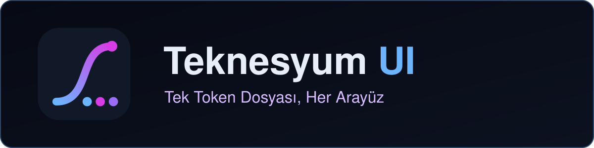
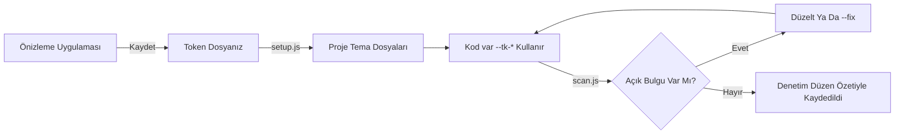
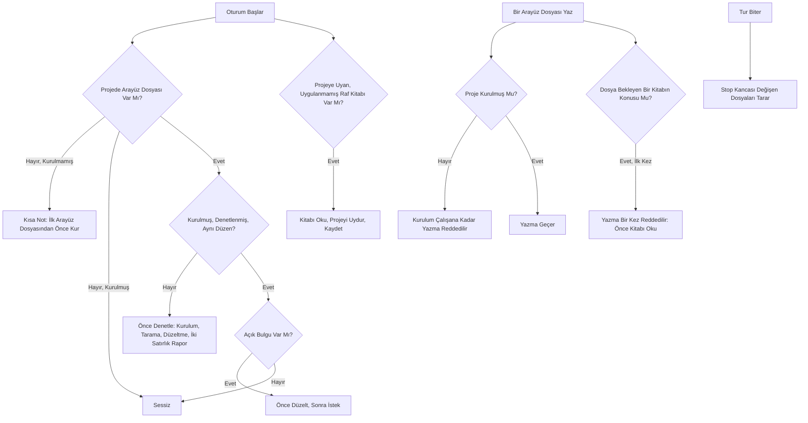

<!-- lang -->

[](README.md)



# Teknesyum UI

Tokenlar, tarayıcı, kancalar.

| | |
|---|---|
| Tarayıcı kuralları | 9 modülde 102 (`scan.js --list-rules`) |
| Temalar | 9 — 5 açık, 4 koyu; hepsi 7:1'i geçer ve 85 veya üzeri puan alır (`tema.js denetle`) |
| Testler | 433 doğrulama, bağımlılık yok (`npm test`) |
| Sıradan bir turun maliyeti | 0 token — hiçbir kanca bir turda bağlam yazmaz |
| Oturum başlangıcının maliyeti | Temiz bir projede 0 token; yapılacak arayüz işi varsa 150–250 token civarı bir not |
| Skill'in maliyeti | `SKILL.md`, 93 satır, yaklaşık 1.000 token, yalnızca arayüz işi başladığında yüklenir |

## Bu Nedir

Renk, tipografi, köşe yarıçapı, hareket, parıltı, başlık çubuğu gibi tek bir arayüz düzenini bir
token dosyasında tutan ve her projenin ondan inşa edilmesini sağlayan bir Claude Code eklentisi.
Kurulum temayı projeye yazar, tarayıcı kodu ona karşı denetler ve üç kanca bu denetimin
çalışmasını garanti eder: bir oturum açıldığında bir kez, ilk arayüz dosyası yazılmadan önce ve
bir tur bittiğinde. Düzen bir masaüstü önizleme uygulamasında düzenlenir, düzyazıda değil.

## Claude Code Bunu Zaten Yapmıyor Mu?

Claude kendi başına düzgün arayüzler yazar, elinize bir tasarım belgesi verirseniz onu da
izler. Yapmadığı şey, on projeyi aylarca aynı düzende tutmaktır. Bu eklenti şunu ekler:

- **Bir değer veridir, öneri değil.** Renkler ve süreler, kodun referans verdiği üretilmiş
  dosyalarda yaşar; model bir stil kılavuzu taşımak yerine ihtiyaç duyduğunda birini okur.
- **Bir kural bir programdır.** `scan.js` içinde 102 kontrol çalışır, çoğunun güvenli bir
  `--fix`'i vardır. Kontrast veya hareketle ilgili hiçbir şey modelin hafızasına bırakılmaz.
- **Denetim isteğe bağlı değildir.** Hiç denetlenmemiş ya da düzeni o zamandan beri değişmiş
  bir proje, kullanıcının isteği ele alınmadan önce denetlenir.
- **Bir değişiklik her projeye ulaşır.** Düzeni önizleme uygulamasında bir kez düzenleyin; her
  proje bir sonraki oturumunda yeni düzen özetini fark edip yeniden üretir.

## Özellikler

- **Önizleme uygulaması.** 15 panelli bir Electron penceresi: renkler, düğmeler, formlar,
  başlık çubuğu, ilerleme, kaydırma çubuğu, arka plan, rozetler, bildirimler, kurulum
  uygulaması, modal, tipografi, hareket, okunurluk ve bir kare-süresi izleyicisi. Her ayar
  canlıdır.
- **Kendi token dosyanız.** Kaydet, inşa ettiğiniz düzeni özel bir token dosyasına yazar;
  `setup.js` o andan itibaren onu varsayılan şablon olarak kullanır.
- **Düzeltmeli tarayıcı.** Kontrast çiftleri, sabit kodlanmış renkler ve süreler, odak
  halkaları, düzen animasyonu, azaltılmış hareket, başlık çubuğu ve kurulum imzaları, WPF ve
  Avalonia'ya özgü noktalar. `--fix`, bir palet rengini `var(--tk-*)`'ine, sabit bir süreyi
  kendi tokenına bağlar.
- **Okunurluk puanı.** Standardın kullandığı her metin/dolgu çifti, ne sıklıkta göründüğüne
  göre ağırlıklandırılıp 0–100 arasında puanlanır; böylece bir renk değişikliği yayımlanmadan
  önce maliyetini gösterir.
- **Beş hedef için üreteçler.** `css`, `react`, `wpf`, `avalonia`, `winforms` — tek bir token
  kaynağı, beş tema dosyası.
- **Şablonlar.** Bir USB kurulum uygulaması, bir başlık çubuğu, bir güncelleme yüzeyi ve
  başsız bir kontrast testi; her biri tarayıcının aradığı bir imza satırı taşır.

## Ne Yapmaz

- Sizin yerinize tasarım yapmaz. Seçtiğiniz bir düzeni tutar ve uygular.
- Çalışma anında hesaplanan renkleri görmez; `denetim.js` bunun için çalışan bir sayfayı
  denetler.
- `teknesyum-ui.json` olmayan bir projeye dokunmaz, ne makine genelinde ne proje bazında.
- TSX, XAML veya C# renklerini otomatik olarak yeniden yazmaz; onları kullanılacak tokenla
  birlikte bildirir. Yerinde düzeltilen tek şey CSS'tir.
- Kişisel bir düzen içermez. Kendi değerleriniz sizin kontrolünüzdeki özel bir depoda kalır.

## Kurulum

```bash
/plugin marketplace add Teknesyum/Teknesyum-Core
```

```bash
/plugin install teknesyum-ui@teknesyum
```

**Claude Code'u yeniden başlat.** Kancalar başlangıçta yüklenir.

Node 18 veya daha yeni gerekir. Önizleme uygulaması için Electron, ilk `onizleme.js`
çalıştırmasında kendini kurar ve isteğe bağlıdır; olmadan `--tarayici` aynı sayfayı bir
tarayıcıda sunar.

Makine geneli bir `~/.claude/teknesyum-ui.json`, standardı her proje için açar;
bir projede `setup.js --apply` onu orada açar. Bu olmadan hiçbir yerde hiçbir şey olmaz,
ve `setup.js --off` onu yeniden kapatır.

## Nasıl Çalışır

### Bir locales Dosyası Gibi Tek Kaynak

Dizelerini `locales/` içinde tutan bir program, bir ekrana dokunmadan dili değiştirebilir.
Bu da görünüm için aynısını yapar: kod `var(--tk-renk-1)`, `{DynamicResource Renk1}`,
`--tk-t-fast`'e başvurur — asla bir onaltılık değere ya da milisaniyeye değil. Tokenı
değiştirin, yeniden üretin, her ekran onu izler. `colour/raw-colour` ve
`core/hardcoded-duration`, herhangi bir sabit değeri başarısız sayar; böylece kural ilk
denetimden sonra da geçerli kalır.



*Şekil 1: önizleme uygulaması token dosyanızı kaydeder, kurulum onu projenin tema
dosyalarına çevirir, kod yalnızca tokenlara başvurur, tarayıcı denetler ve temiz bir denetim
hangi düzene karşı yapıldığını kaydeder.*

### Kancalar Ne Zaman Konuşur



*Şekil 2: oturum başlangıcında kanca temiz bir projede sessiz kalır, henüz arayüzü olmayan bir
projede bir not bırakır ve bir proje hiç kurulmamışsa, hiç denetlenmemişse ya da düzeni
değiştiyse önce bir denetim ister; bir arayüz dosyası yazmak kurulum çalışana kadar
reddedilir; Stop kancası turun değiştirdiklerini tarar. Projeye uyan ve hiç uygulanmamış ya da o
zamandan beri değişmiş bir özel raf kitabı, başlangıçta bir not ve bir kez reddedilen bir
yazma alır.*

### Maliyeti Nedir

| An | Token | Neden |
|---|---|---|
| Sıradan bir tur | 0 | Hiçbir kanca bir turda `additionalContext` yazmaz; biri yazmaya başlarsa bir test başarısız olur |
| Oturum başlangıcı, temiz proje | 0 | Kanca taramayı çalıştırır ve hiçbir şey yazdırmaz |
| Oturum başlangıcı, yapılacak iş | Bir kez, 150–350 civarı | Tek bir talimat, 420–1.090 karakter olarak ölçüldü |
| Hiç kurulmamış bir projede ilk arayüz yazımı | Bir kez, 100 civarı | Ret gerekçesi, 321 karakter |
| Bekleyen bir raf kitabının dosyasına ilk yazma | Kitap ve oturum başına bir kez, 150 civarı | Ret gerekçesi, 437 karakter olarak ölçüldü |
| Bir kuralı bozan bir tur | bulgu satırları | Stop kancası bulgularla engeller ve aynı dosyada iki engelden sonra durur |
| Arayüz işi başlar | Bir kez, 1.000 civarı | `SKILL.md` |

Karakter sayıları kancaların gerçek çıktısından ölçülür, token sayıları o değerin üçe
bölünüp yuvarlanmasıdır.

### Özel Raf

Düzyazı kurallar ve kendi düzeniniz bu deponun dışında, sizin tuttuğunuz özel bir depoda
yaşar. Eklenti onu yalnızca erişilebilir olduğunda okur: `TEKNESYUM_PRIVATE`, ya da
`<config>/teknesyum-private/`. Ayrıntılı kurallar `teknesyum-ui/kurallar/` içinde, token
dosyanız `teknesyum-ui/benim.tokens.json` içinde oturur. Raf olmadan eklenti kamuya açık
standardı kullanır — sade siyah, beyaz ve gri — ve başka hiçbir şey değişmez. Onu kendi
rafınıza yönlendirin, ya da öyle bırakın.

Raf, yerleşik bir kural takımı gibi uygulanır. `private/tercihler/` içinde bir ön bilgi
bloğuyla açılan bir kitap ne zaman geçerli olduğunu söyler — `tetik` (yol regex'i), `icerik`
(içerik regex'i) ya da `her: evet` (her proje) — ve ne istediğini, tarayıcının `raf/ister`
olarak çalıştırdığı `ister` satırlarıyla. Projeye uyan ve proje tarafından güncel özetiyle
kaydedilmemiş bir kitap bekler: oturum kancası adını verir, konusuna ilk yazma bir kez
reddedilir ve `raf.js --uydu <kitap>` onu yalnızca kontrolleri geçtiğinde kaydeder. Özet
kitabı ve `kurallar/` içindeki teknik eşini kapsar, ikisinden biri düzenlenirse kitap yeniden
bekler. `raf.js --uyan` uyan her kitabı ve durumunu listeler. Biçim
[docs/RULE-API.md](docs/RULE-API.md) içindedir.

## Program Ne Yaptığını Gösterir

Altı panel, dokuz temadan altısı.


**Akıcılık, Gece Mavisi.** Aynı grafik üzerinde iki yumuşatma eğrisi, her biri kayma, ölçek,
panel ve kademeli liste gösterimlerini yan yana yönetiyor.


**Okunurluk, Kar Beyazı.** Şimdiki okunurluk puanı token dosyasına karşı, ve bir renk
değişikliğinin en çok hangi parçaları oynattığı.


**Teknik, Kor.** Kare hızı, ortalama, P95 ve en kötü kare, düşen kareler, ve son 300 karenin
grafiği.


**Renkler Ve Tonlar, Kadife.** Her ton basamağı onaltılık değeri ve kontrastıyla; 7:1'in
altındaki basamaklar üstü çizili gösterilir.


**Düğmeler, Sıcak Kâğıt.** Birincil, hayalet ve tehlike düğmeleri dururken, üzerine
gelindiğinde, basılıyken, odaktayken ve devre dışıyken, oranlarıyla birlikte.


**Tipografi, Grafit.** Kahramandan ipucuna kadar tip skalası, boyut, ağırlık ve kontrastıyla.

## Geliştiriciler İçin

### Komutlar

```bash
node <plugin>/scripts/setup.js --apply --project <dir> [--template benim|neon|custom] [--targets css,react]
```

```bash
node <plugin>/scripts/scan.js <project-root> [--fix] [--json] [--files a.css,b.tsx] [--list-rules]
```

```bash
node <plugin>/scripts/raf.js [book]
```

```bash
node <plugin>/scripts/scaffold.js kur|ustcubuk|durum|denetim <args>
```

```bash
node <plugin>/scripts/denetim.js http://localhost:5173 [--esik 7]
```

```bash
node ui/scripts/onizleme.js [--tarayici]
```

```bash
node ui/scripts/tema.js liste
```

`scan.js` temizken `0`, bulgularla `1`, yapılandırılmamışken ya da kapalıyken `2` ile çıkar.
Sıfır açık bulguyla yapılan proje geneli bir tarama, projenin `.claude/teknesyum-ui.json`
dosyasına `denetim: {tarih, duzen}` yazar; oturum kancası `duzen`'i geçerli düzen özetiyle
karşılaştırır.

### Yerleşim

```
ui/scripts/setup.js       kurulum ve üretim
ui/scripts/generate.js    tokenlar -> theme.css, Theme.xaml, Theme.axaml, Palette.cs
ui/scripts/scan.js        tarayıcı
ui/scripts/rules/*.js     kurallar, alan başına bir modül
ui/scripts/raf.js         özel rafı okur
ui/scripts/ozel.js        özel kayıt ve token dosyası
ui/scripts/kaydet.js      yeni token değerlerinin kamuya açık yayımı
ui/hooks/baslangic.js     SessionStart: gerektiğinde önce denetle
ui/hooks/once.js          PreToolUse: kurulumdan önce arayüz yazımı yok
ui/hooks/guard.js         Stop: turun değiştirdiğini tara
ui/onizleme/              önizleme uygulaması (sayfa + Electron kabuğu)
ui/templates/             kurulum uygulaması, başlık çubuğu, güncelleme yüzeyi, temalar
ui/skills/teknesyum-ui/   SKILL.md, referanslar, varlıklar
docs/diagram.md           bu README'deki her akış diyagramı
docs/RULE-API.md          bir kural nasıl yazılır
docs/DECISIONS.md         neden bu şekilde tasarlandı
```

### Testler

```bash
npm test
```

433 doğrulama. Maliyet doğrulamaları; oturum kancası dışında bir kanca bağlam yazarsa,
`SKILL.md` bütçesinin ötesine geçerse ya da bir slash komutu yeniden ortaya çıkarsa
başarısız olur. Standart da kendi tarayıcısından geçmek zorundadır.

## Katkıda Bulunma

Kod yazmadan önce bir issue açın. Bir pull request'i tek bir konuya bağlı tutun ve çevresindeki
koda uyun. Depo dili İngilizcedir. Önce `npm test` çalıştırın; kırmızıyla hiçbir şey
birleştirilmez. Katkılar AGPL-3.0-or-later altında kabul edilir. Bu size zaman
kazandırıyorsa, sponsorluk onu sürdürür.

## Lisans

AGPL-3.0-or-later — [LICENSE](LICENSE).

<div align="center">

<a href="https://github.com/sponsors/Teknesyum"></a>
&nbsp;
<a href="LICENSE"></a>

</div>
