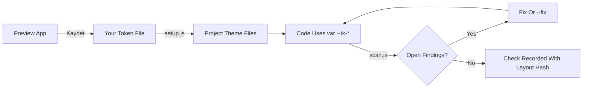
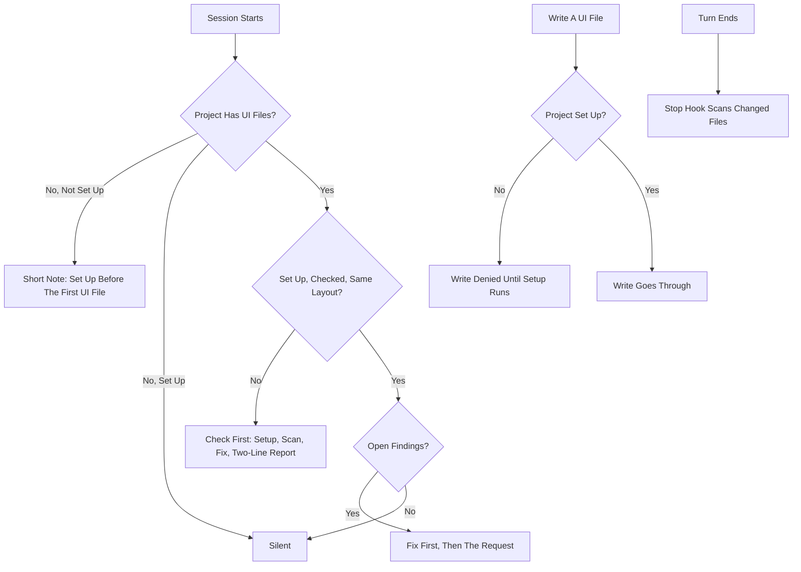
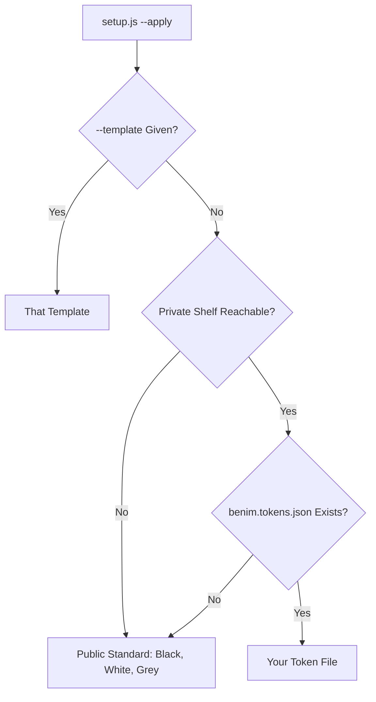

# Diagrams

Every flow the README describes, in one place.

## Token Flow

*Figure 1: the preview app saves your token file, setup turns it into the project's theme
files, the code references only tokens, the scanner checks it, and a clean scan records which
layout it was checked against.*

## Hooks

*Figure 2: at session start the hook stays silent on a clean project, leaves a note on a
project with no interface yet, and asks for a check first when a project was never set up,
never checked or its layout changed; writing a UI file is refused until setup has run; the
Stop hook scans what the turn changed.*

## Which Template Setup Uses

*Figure 3: setup takes the template you name; otherwise it uses your token file when the
private shelf is reachable and holds one, and the public standard when it does not.*
